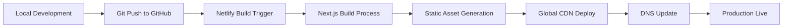

# BBWA SWMS Management System - Deployment & DevOps Architecture

## Change Log

| Date | Version | Description | Author |
|------|---------|-------------|---------|
| 2025-01-09 | v1.0 | Initial deployment and DevOps architecture | Claude Code |

## Document Overview

This document outlines the deployment, infrastructure, security, and operational architecture for the BBWA SWMS Management System. It complements the existing architecture documents by focusing on production deployment, monitoring, security patterns, and operational excellence.

**Related Documents:**
- [Project Brief](../brief.md) - Business requirements
- [PRD](../prd.md) - Detailed requirements

**Development Architecture Documents:**
- [Tech Stack](./architecture/tech-stack.md) - Complete technology stack and tooling
- [Coding Standards](./architecture/coding-standards.md) - Development conventions and patterns
- [Source Tree](./architecture/source-tree.md) - Project structure and file organization

## Infrastructure Architecture

### Current Production Environment

**Primary Infrastructure Stack:**
```
Production Environment (Current State)
├── Frontend: Netlify Edge Network
│   ├── CDN: Global edge locations
│   ├── Build: Next.js static optimization
│   └── Domain: baysidebuilderswa.com.au
├── Backend: Supabase Cloud Platform
│   ├── Database: PostgreSQL 17.4 (Australia East)
│   ├── Authentication: Supabase Auth
│   ├── Storage: Supabase Storage buckets
│   └── Edge Functions: Deno runtime
└── External Services:
    ├── Airtable: Business data sync
    ├── Google Maps: Geolocation services
    └── Email: SMTP via Edge Functions
```

### SWMS Enhancement Infrastructure Requirements

**Additional Infrastructure Components:**
```
SWMS Production Enhancements
├── Email Automation Infrastructure
│   ├── Email Service: Supabase Edge Functions + SMTP
│   ├── Campaign Management: Database-driven workflows
│   ├── Delivery Tracking: Audit logs in PostgreSQL
│   └── Template Storage: Supabase Storage bucket
├── Document Management Infrastructure  
│   ├── File Storage: Supabase Storage (swms-documents bucket)
│   ├── Access Control: Row Level Security + signed URLs
│   ├── Virus Scanning: Edge Function integration
│   └── Backup: Automated daily snapshots
├── Workflow Automation Infrastructure
│   ├── Triggers: Database triggers for automation
│   ├── Scheduling: cron-based Edge Functions
│   ├── Notifications: Real-time via Supabase Realtime
│   └── Audit Logging: Comprehensive tracking tables
└── Monitoring Infrastructure
    ├── Application Monitoring: Supabase Analytics
    ├── Performance Monitoring: Netlify Analytics  
    ├── Error Tracking: Supabase Edge Function logs
    └── Uptime Monitoring: External service monitoring
```

### Network Architecture & Security

**Network Security Model:**
```
Security Boundaries
├── Public Layer
│   ├── Marketing site (/)
│   ├── Worker induction (/induction)
│   ├── Worker check-in (/check-in)
│   └── SWMS submission portals (/swms-portal/[token])
├── Authenticated Layer
│   ├── Admin dashboard (/admin/*)
│   ├── Protected API routes (/api/admin/*)
│   └── Private file storage access
└── System Layer
    ├── Database (RLS protected)
    ├── Edge Functions (authenticated)
    └── Internal API communications
```

**API Security Architecture:**
```typescript
// Security Patterns for SWMS APIs
interface SecurityModel {
  // Public portals use token-based access
  tokenAccess: {
    swmsSubmission: "UUID token with expiry"
    workerCheckIn: "QR code token validation"
  }
  
  // Admin functions require Supabase Auth
  adminAccess: {
    authentication: "Supabase Auth JWT"
    authorization: "RLS policies"
    sessionManagement: "Automatic refresh"
  }
  
  // Database security via RLS
  dataAccess: {
    rowLevelSecurity: "User/role based filtering"
    auditLogging: "All operations logged"
    dataEncryption: "At rest and in transit"
  }
}
```

## Deployment Architecture

### Current Deployment Pipeline

**Existing Deployment Flow (Netlify):**


### SWMS Enhanced Deployment Pipeline

**Database Migration Strategy:**
```bash
# Deployment sequence for SWMS features
1. Database Migrations (Supabase)
   - Run migrations via Supabase CLI
   - Apply RLS policies
   - Verify foreign key constraints

2. Edge Function Deployment
   - Deploy email automation functions
   - Test function endpoints
   - Verify environment variables

3. Frontend Deployment
   - Build with new SWMS components
   - Deploy to Netlify staging
   - Run smoke tests
   - Promote to production

4. Post-deployment Verification
   - Test contractor portal access
   - Verify email automation
   - Check admin dashboard functionality
   - Validate data integrity
```

**Environment Management:**
```typescript
// Environment Configuration Strategy
interface DeploymentEnvironments {
  development: {
    database: "Local Supabase"
    frontend: "localhost:3000"
    email: "Mock/Test mode"
    storage: "Local bucket"
  }
  
  staging: {
    database: "Supabase staging project"
    frontend: "staging.netlify.app"  
    email: "Test email addresses"
    storage: "Staging bucket"
  }
  
  production: {
    database: "Supabase production"
    frontend: "baysidebuilderswa.com.au"
    email: "Live SMTP delivery"
    storage: "Production bucket"
  }
}
```

### Database Deployment Strategy

**Migration Management:**
```sql
-- SWMS database migration sequence
-- Migration 1: Contractors table foundation
CREATE TABLE contractors (
    id uuid PRIMARY KEY DEFAULT gen_random_uuid(),
    company_name text NOT NULL,
    primary_contact text,
    email text NOT NULL,
    phone text,
    abn text,
    created_at timestamptz DEFAULT now(),
    updated_at timestamptz DEFAULT now()
);

-- Migration 2: Update workers table
ALTER TABLE workers 
ADD COLUMN contractor_id uuid REFERENCES contractors(id);

-- Migration 3: SWMS jobs table
CREATE TABLE swms_jobs (
    id uuid PRIMARY KEY DEFAULT gen_random_uuid(),
    job_site_id uuid REFERENCES job_sites(id) NOT NULL,
    name text NOT NULL,
    description text,
    status text DEFAULT 'draft',
    deadline date,
    created_at timestamptz DEFAULT now()
);

-- Migration 4: SWMS submissions table
CREATE TABLE swms_submissions (
    id uuid PRIMARY KEY DEFAULT gen_random_uuid(),
    swms_job_id uuid REFERENCES swms_jobs(id) NOT NULL,
    contractor_id uuid REFERENCES contractors(id) NOT NULL,
    document_url text,
    submission_token uuid DEFAULT gen_random_uuid(),
    submitted_at timestamptz,
    status text DEFAULT 'pending',
    created_at timestamptz DEFAULT now()
);
```

**RLS Policy Deployment:**
```sql
-- Row Level Security policies for SWMS tables
-- Contractors table policies
CREATE POLICY "Admin can manage contractors" ON contractors
    FOR ALL USING (auth.jwt() ->> 'role' = 'admin');

-- SWMS jobs policies  
CREATE POLICY "Admin can manage SWMS jobs" ON swms_jobs
    FOR ALL USING (auth.jwt() ->> 'role' = 'admin');

-- SWMS submissions policies
CREATE POLICY "Admin can view all submissions" ON swms_submissions
    FOR SELECT USING (auth.jwt() ->> 'role' = 'admin');

CREATE POLICY "Contractors can submit via token" ON swms_submissions
    FOR INSERT WITH CHECK (
        EXISTS(
            SELECT 1 FROM swms_jobs 
            WHERE id = swms_job_id 
            AND status = 'active'
        )
    );
```

## Security Architecture

### Authentication & Authorization

**Current Security Model (Extended for SWMS):**
```typescript
interface SecurityArchitecture {
  // Existing authentication patterns
  adminAuth: {
    provider: "Supabase Auth"
    method: "Email/password + session cookies"
    protection: "/admin/* routes protected"
    mfa: "Optional TOTP"
  }
  
  // New SWMS-specific security patterns
  contractorAccess: {
    method: "Token-based (no account required)"
    scope: "Single submission per token"
    expiry: "7 days default"
    validation: "UUID + database lookup"
  }
  
  // Data access security
  databaseSecurity: {
    rls: "All tables protected by RLS"
    audit: "All operations logged"
    encryption: "TDE + column-level encryption"
    backup: "Encrypted automated backups"
  }
}
```

### Data Security & Compliance

**Australian Compliance Requirements:**
```typescript
interface ComplianceArchitecture {
  // Privacy Act compliance
  dataRetention: {
    personalData: "7 years minimum for construction records"
    swmsDocuments: "Permanent retention for regulatory compliance"
    auditLogs: "7 years for compliance audits"
    emailLogs: "2 years for communication records"
  }
  
  // Work Safe compliance
  documentSecurity: {
    storage: "Australian data centres (Supabase AU East)"
    access: "Role-based with audit trails"
    integrity: "Digital signatures and checksums"
    availability: "99.9% uptime SLA"
  }
  
  // Data sovereignty
  dataLocation: {
    primary: "Australia East (Sydney)"
    backup: "Australia Southeast (Melbourne)"
    crossBorder: "No data stored outside Australia"
    processing: "Edge functions in Australian regions"
  }
}
```

### File Storage Security

**SWMS Document Security Model:**
```typescript
interface FileStorageSecurity {
  bucketStructure: {
    "swms-documents": {
      path: "/job-sites/{job_id}/submissions/{contractor_id}/"
      access: "RLS + signed URLs"
      expiry: "24 hours for download links"
      encryption: "AES-256 at rest"
    }
    
    "site-maps": {
      path: "/job-sites/{job_id}/maps/"
      access: "Admin only"
      expiry: "No expiry for admin access"
      encryption: "AES-256 at rest"
    }
  }
  
  virusScanning: {
    integration: "Edge Function + external service"
    action: "Quarantine suspicious files"
    notification: "Alert admin immediately"
    cleanup: "Auto-delete after 30 days"
  }
}
```

## Monitoring & Observability

### Application Performance Monitoring

**Performance Monitoring Strategy:**
```typescript
interface MonitoringArchitecture {
  // Frontend monitoring
  clientSide: {
    metrics: ["Core Web Vitals", "Load times", "Error rates"]
    tools: ["Netlify Analytics", "Browser console tracking"]
    alerts: ["Performance degradation", "High error rates"]
  }
  
  // Backend monitoring  
  serverSide: {
    database: ["Query performance", "Connection pools", "RLS overhead"]
    edgeFunctions: ["Execution time", "Memory usage", "Error rates"]
    storage: ["Upload speeds", "Download reliability", "Quota usage"]
  }
  
  // Business metrics
  businessKPIs: {
    swmsMetrics: ["Submission rates", "Email delivery", "Portal usage"]
    complianceMetrics: ["Document completeness", "Deadline compliance"]
    userExperience: ["Portal completion rates", "Admin efficiency"]
  }
}
```

### Logging & Audit Architecture

**Comprehensive Audit Strategy:**
```sql
-- Audit logging tables for SWMS system
CREATE TABLE swms_audit_logs (
    id uuid PRIMARY KEY DEFAULT gen_random_uuid(),
    table_name text NOT NULL,
    operation text NOT NULL, -- INSERT, UPDATE, DELETE
    record_id uuid NOT NULL,
    old_values jsonb,
    new_values jsonb,
    user_id uuid,
    ip_address text,
    user_agent text,
    timestamp timestamptz DEFAULT now()
);

-- Email audit logging
CREATE TABLE email_audit_logs (
    id uuid PRIMARY KEY DEFAULT gen_random_uuid(),
    campaign_id uuid,
    recipient_email text NOT NULL,
    email_type text NOT NULL, -- initial, reminder_1, reminder_2, etc.
    status text NOT NULL, -- sent, delivered, bounced, failed
    external_id text, -- SMTP provider message ID
    sent_at timestamptz DEFAULT now(),
    delivered_at timestamptz,
    error_message text
);

-- Portal access logging
CREATE TABLE portal_access_logs (
    id uuid PRIMARY KEY DEFAULT gen_random_uuid(),
    submission_token uuid NOT NULL,
    ip_address text,
    user_agent text,
    action text NOT NULL, -- view, upload, submit
    success boolean DEFAULT true,
    error_message text,
    timestamp timestamptz DEFAULT now()
);
```

### Alert & Notification System

**Operational Alerts:**
```typescript
interface AlertingSystem {
  // Critical system alerts
  systemAlerts: {
    databaseDown: "Immediate SMS + email to Frank"
    edgeFunctionFailure: "Email within 5 minutes"
    fileUploadFailure: "Email within 15 minutes"
    authenticationIssues: "Email within 10 minutes"
  }
  
  // Business process alerts
  businessAlerts: {
    swmsOverdue: "Daily digest to Frank"
    emailDeliveryFailure: "Hourly summary if > 5% failure rate"
    unusualPortalActivity: "Email if suspicious access patterns"
    complianceDeadlines: "7/3/1 day warnings to Frank"
  }
  
  // Performance alerts
  performanceAlerts: {
    slowQueries: "Log and weekly report"
    portalLoadTime: "Email if > 5 seconds"
    adminDashboardPerformance: "Alert if > 3 seconds"
    storageQuotaWarning: "Alert at 80% usage"
  }
}
```

## Disaster Recovery & Business Continuity

### Backup Strategy

**Data Backup Architecture:**
```typescript
interface BackupStrategy {
  // Database backups
  databaseBackup: {
    frequency: "Automated daily snapshots"
    retention: "Daily for 30 days, weekly for 1 year"
    location: "Multiple Australian regions"
    testing: "Monthly restore testing"
  }
  
  // File storage backups
  fileBackup: {
    swmsDocuments: "Real-time replication + daily snapshots"
    siteMaps: "Daily backup with versioning"
    templates: "Weekly backup sufficient"
    retention: "7 years for compliance documents"
  }
  
  // Configuration backups
  configBackup: {
    environmentVariables: "Encrypted weekly backup"
    databaseSchema: "Version controlled in Git"
    deploymentConfig: "Git repository backup"
    certificates: "Secure weekly backup"
  }
}
```

### Recovery Procedures

**Disaster Recovery Plan:**
```typescript
interface DisasterRecovery {
  // Service level objectives
  slo: {
    rto: "2 hours for admin functions"  // Recovery Time Objective
    rpo: "15 minutes for data loss"     // Recovery Point Objective
    availability: "99.9% monthly uptime"
  }
  
  // Recovery procedures
  procedures: {
    databaseFailure: {
      detection: "Automated monitoring alerts"
      response: "Switch to standby replica"
      recovery: "Point-in-time restore if needed"
      validation: "Data integrity checks"
    }
    
    frontendFailure: {
      detection: "Netlify uptime monitoring"
      response: "Automatic CDN failover"
      recovery: "Rebuild and redeploy"
      validation: "Full smoke test suite"
    }
    
    completeOutage: {
      detection: "Multi-point monitoring failure"
      response: "Emergency communication to users"
      recovery: "Full environment rebuild"
      validation: "Comprehensive system testing"
    }
  }
}
```

## Scaling & Performance Architecture

### Performance Optimization Strategy

**Database Performance:**
```sql
-- Database optimization for SWMS system
-- Indexes for common query patterns
CREATE INDEX idx_swms_jobs_site_status ON swms_jobs(job_site_id, status);
CREATE INDEX idx_swms_submissions_job_contractor ON swms_submissions(swms_job_id, contractor_id);
CREATE INDEX idx_contractors_company_name ON contractors USING gin(company_name gin_trgm_ops);
CREATE INDEX idx_email_logs_campaign_status ON email_audit_logs(campaign_id, status);

-- Partial indexes for active records only
CREATE INDEX idx_active_swms_jobs ON swms_jobs(job_site_id) WHERE status = 'active';
CREATE INDEX idx_pending_submissions ON swms_submissions(swms_job_id) WHERE status = 'pending';
```

**Frontend Performance:**
```typescript
interface PerformanceStrategy {
  // Static optimization
  staticOptimization: {
    nextjsSSG: "Pre-build marketing pages"
    imageOptimization: "Next.js Image component with optimization"
    bundleSplitting: "Route-based code splitting"
    treeShaking: "Remove unused dependencies"
  }
  
  // Runtime optimization  
  runtimeOptimization: {
    databaseCaching: "Supabase cache-control headers"
    clientSideCaching: "React Query for API calls"
    componentMemoization: "React.memo for heavy components"
    lazyLoading: "Code splitting for admin panels"
  }
  
  // CDN optimization
  cdnOptimization: {
    globalDistribution: "Netlify Edge Network"
    compressionGzip: "Automatic asset compression"
    cacheHeaders: "Aggressive caching for static assets"
    edgeSSR: "Edge-side rendering where beneficial"
  }
}
```

### Scaling Strategy

**Current Capacity Planning:**
```typescript
interface CapacityPlanning {
  // Current usage baseline
  currentLoad: {
    adminUsers: "1 primary (Frank)"
    contractorPortalUsers: "20-50 concurrent max"
    monthlyJobs: "10-15 SWMS campaigns"
    documentStorage: "~500MB growth per month"
    databaseOperations: "~1000 queries per day"
  }
  
  // Growth projections
  scalingProjection: {
    yearOne: {
      adminUsers: "1-2 users"
      contractorUsers: "100+ concurrent peak"
      monthlyJobs: "25+ SWMS campaigns"
      documentStorage: "~2GB monthly growth"
      databaseOperations: "~5000 queries per day"
    }
    
    yearThree: {
      adminUsers: "3-5 users (if expanded to other builders)"
      contractorUsers: "500+ concurrent peak"
      monthlyJobs: "100+ SWMS campaigns"
      documentStorage: "~10GB monthly growth"
      databaseOperations: "~25000 queries per day"
    }
  }
  
  // Scaling triggers
  scalingTriggers: {
    databaseUpgrade: "When query time > 500ms consistently"
    storageUpgrade: "When approaching plan limits"
    edgeFunctionUpgrade: "When function timeouts occur"
    netlifyUpgrade: "When build times > 5 minutes"
  }
}
```

## Development & Operations Integration

### CI/CD Pipeline Enhancement

**Development Workflow:**
```yaml
# GitHub Actions workflow for SWMS features
name: SWMS Development Pipeline
on:
  push:
    branches: [main, develop, feature/swms-*]
  pull_request:
    branches: [main, develop]

jobs:
  test:
    runs-on: ubuntu-latest
    steps:
      - uses: actions/checkout@v3
      - name: Setup Node.js
        uses: actions/setup-node@v3
        with:
          node-version: '18'
      - name: Install dependencies
        run: npm ci
      - name: Run TypeScript checks
        run: npm run typecheck
      - name: Run tests
        run: npm test
      - name: Run E2E tests for SWMS flows
        run: npm run test:e2e:swms
        
  database:
    runs-on: ubuntu-latest
    steps:
      - name: Run database migrations (staging)
        run: npx supabase db push --staging
      - name: Verify migration integrity
        run: npm run verify:migrations
        
  deploy:
    needs: [test, database]
    runs-on: ubuntu-latest
    if: github.ref == 'refs/heads/main'
    steps:
      - name: Deploy to production
        run: netlify deploy --prod
      - name: Run smoke tests
        run: npm run test:smoke:production
```

### Environment Configuration Management

**Configuration Strategy:**
```bash
# Environment variable management for SWMS
# Development (.env.local)
NEXT_PUBLIC_SUPABASE_URL=http://localhost:54321
NEXT_PUBLIC_SUPABASE_ANON_KEY=local-anon-key
SUPABASE_SERVICE_ROLE_KEY=local-service-key

# SWMS-specific development config
SWMS_EMAIL_MODE=mock
SWMS_DOCUMENT_STORAGE=local
SWMS_DEBUG_LOGGING=true

# Production (Netlify environment variables)
NEXT_PUBLIC_SUPABASE_URL=https://your-project.supabase.co
NEXT_PUBLIC_SUPABASE_ANON_KEY=prod-anon-key  
SUPABASE_SERVICE_ROLE_KEY=prod-service-key

# SWMS-specific production config
SWMS_EMAIL_MODE=live
SWMS_DOCUMENT_STORAGE=supabase
SWMS_DEBUG_LOGGING=false
SWMS_EMAIL_FROM=admin@baysidebuilderswa.com.au
```

## Security Operations

### Security Monitoring

**Security Event Monitoring:**
```typescript
interface SecurityMonitoring {
  // Authentication monitoring
  authSecurity: {
    failedLoginAttempts: "Lock after 5 attempts, alert after 10"
    unusualLoginPatterns: "Geographic/time-based anomalies"
    sessionHijacking: "Multiple concurrent sessions"
    privilegeEscalation: "Unauthorized admin access attempts"
  }
  
  // Data access monitoring
  dataAccessSecurity: {
    bulkDataExtraction: "Alert on large query results"
    unauthorizedTableAccess: "RLS policy violations"
    sensitiveDataAccess: "Document access without valid tokens"
    databaseConnectionAnomalies: "Unusual connection patterns"
  }
  
  // Application security
  applicationSecurity: {
    sqlInjectionAttempts: "Malformed query detection"
    xssAttempts: "Script injection detection in forms"
    csrfProtection: "Invalid token submissions"
    fileUploadVulnerabilities: "Malicious file detection"
  }
}
```

### Incident Response

**Security Incident Response Plan:**
```typescript
interface IncidentResponse {
  // Incident classification
  severity: {
    critical: "Data breach, system compromise"
    high: "Service disruption, authentication bypass"
    medium: "Performance degradation, minor vulnerabilities"
    low: "Configuration issues, non-critical alerts"
  }
  
  // Response procedures
  responseMatrix: {
    critical: {
      detection: "Immediate automated alerts"
      response: "Isolate affected systems within 15 minutes"
      communication: "Notify Frank immediately via SMS"
      recovery: "Full incident response team activation"
      postmortem: "Comprehensive review within 48 hours"
    }
    
    high: {
      detection: "Automated alerts within 5 minutes"
      response: "Assess and contain within 1 hour"
      communication: "Email Frank within 30 minutes"
      recovery: "Restore service within 4 hours"
      postmortem: "Review within 1 week"
    }
  }
}
```

## Operational Excellence

### Service Level Agreements

**Internal SLAs:**
```typescript
interface ServiceLevelAgreements {
  // System availability
  availability: {
    adminDashboard: "99.9% monthly uptime"
    contractorPortals: "99.5% monthly uptime"
    emailDelivery: "95% successful delivery within 1 hour"
    documentStorage: "99.9% availability for uploads/downloads"
  }
  
  // Performance benchmarks
  performance: {
    adminPageLoad: "< 3 seconds (P95)"
    contractorPortalLoad: "< 5 seconds mobile (P95)"
    databaseQueries: "< 500ms (P95)"
    fileUploads: "< 30 seconds for 10MB files"
  }
  
  // Support response times
  support: {
    criticalIssues: "Response within 4 hours"
    highPriorityIssues: "Response within 24 hours"
    mediumPriorityIssues: "Response within 3 days"
    enhancementRequests: "Assessment within 1 week"
  }
}
```

### Maintenance & Updates

**System Maintenance Strategy:**
```typescript
interface MaintenanceStrategy {
  // Regular maintenance windows
  scheduledMaintenance: {
    database: "Monthly maintenance - Sunday 2-4 AM AWST"
    deployment: "Weekly deployments - Friday 6-8 PM AWST"
    security: "Quarterly security updates"
    performance: "Monthly performance optimization review"
  }
  
  // Update management
  updateStrategy: {
    dependencies: "Weekly automated updates for non-breaking changes"
    nextjs: "Major version updates quarterly with testing"
    supabase: "Following Supabase release schedule with validation"
    security: "Immediate deployment for critical security patches"
  }
  
  // Change management
  changeControl: {
    testing: "All changes require staging environment validation"
    rollback: "Automated rollback capability for all deployments"
    documentation: "All changes documented in change log"
    approval: "Frank approval required for major changes"
  }
}
```

## Cost Optimization

### Cost Management Strategy

**Infrastructure Cost Analysis:**
```typescript
interface CostOptimization {
  // Current cost baseline
  currentCosts: {
    supabase: "$25/month (Pro plan)"
    netlify: "$19/month (Pro plan)"
    domain: "$15/year"
    monitoring: "$0 (included in platform costs)"
    totalMonthly: "~$44/month"
  }
  
  // SWMS feature cost impact
  additionalCosts: {
    edgeFunctionUsage: "+$5-10/month (email automation)"
    storageIncrease: "+$2-5/month (document storage)"
    bandwidthIncrease: "+$1-3/month (portal traffic)"
    externalServices: "$0 (using included services)"
    totalAdditional: "+$8-18/month"
  }
  
  // Cost optimization strategies
  optimizationStrategies: {
    databaseOptimization: "Regular query performance review"
    storageCleanup: "Automated cleanup of expired tokens"
    functionOptimization: "Edge function performance tuning"
    bandwidthOptimization: "Image and asset optimization"
  }
}
```

## Conclusion

This deployment and DevOps architecture provides a comprehensive framework for successfully deploying, operating, and maintaining the BBWA SWMS Management System. The architecture leverages existing infrastructure while introducing necessary enhancements for SWMS functionality.

**Key Architectural Principles:**
1. **Security First:** All components designed with security as a primary concern
2. **Operational Excellence:** Comprehensive monitoring, logging, and alert systems
3. **Scalability:** Architecture supports growth from current to future requirements  
4. **Cost Efficiency:** Optimal use of existing infrastructure with minimal additional costs
5. **Compliance Ready:** Built to meet Australian regulatory and audit requirements

**Next Steps:**
1. Review and approve this deployment architecture
2. Begin implementation following the deployment pipeline outlined
3. Establish monitoring and alerting systems during development
4. Create operational runbooks for production support
5. Schedule regular architecture review cycles

This document should be used alongside the existing SWMS architecture, UI architecture, and PRD documents to ensure successful system delivery and operation.