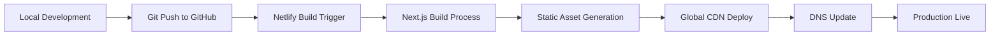

# Deployment Architecture

## Current Deployment Pipeline

**Existing Deployment Flow (Netlify):**


## SWMS Enhanced Deployment Pipeline

**Database Migration Strategy:**
```bash
# Deployment sequence for SWMS features
1. Database Migrations (Supabase)
   - Run migrations via Supabase CLI
   - Apply RLS policies
   - Verify foreign key constraints

2. Edge Function Deployment
   - Deploy email automation functions
   - Test function endpoints
   - Verify environment variables

3. Frontend Deployment
   - Build with new SWMS components
   - Deploy to Netlify staging
   - Run smoke tests
   - Promote to production

4. Post-deployment Verification
   - Test contractor portal access
   - Verify email automation
   - Check admin dashboard functionality
   - Validate data integrity
```

**Environment Management:**
```typescript
// Environment Configuration Strategy
interface DeploymentEnvironments {
  development: {
    database: "Local Supabase"
    frontend: "localhost:3000"
    email: "Mock/Test mode"
    storage: "Local bucket"
  }
  
  staging: {
    database: "Supabase staging project"
    frontend: "staging.netlify.app"  
    email: "Test email addresses"
    storage: "Staging bucket"
  }
  
  production: {
    database: "Supabase production"
    frontend: "baysidebuilderswa.com.au"
    email: "Live SMTP delivery"
    storage: "Production bucket"
  }
}
```

## Database Deployment Strategy

**Migration Management:**
```sql
-- SWMS database migration sequence
-- Migration 1: Contractors table foundation
CREATE TABLE contractors (
    id uuid PRIMARY KEY DEFAULT gen_random_uuid(),
    company_name text NOT NULL,
    primary_contact text,
    email text NOT NULL,
    phone text,
    abn text,
    created_at timestamptz DEFAULT now(),
    updated_at timestamptz DEFAULT now()
);

-- Migration 2: Update workers table
ALTER TABLE workers 
ADD COLUMN contractor_id uuid REFERENCES contractors(id);

-- Migration 3: SWMS jobs table
CREATE TABLE swms_jobs (
    id uuid PRIMARY KEY DEFAULT gen_random_uuid(),
    job_site_id uuid REFERENCES job_sites(id) NOT NULL,
    name text NOT NULL,
    description text,
    status text DEFAULT 'draft',
    deadline date,
    created_at timestamptz DEFAULT now()
);

-- Migration 4: SWMS submissions table
CREATE TABLE swms_submissions (
    id uuid PRIMARY KEY DEFAULT gen_random_uuid(),
    swms_job_id uuid REFERENCES swms_jobs(id) NOT NULL,
    contractor_id uuid REFERENCES contractors(id) NOT NULL,
    document_url text,
    submission_token uuid DEFAULT gen_random_uuid(),
    submitted_at timestamptz,
    status text DEFAULT 'pending',
    created_at timestamptz DEFAULT now()
);
```

**RLS Policy Deployment:**
```sql
-- Row Level Security policies for SWMS tables
-- Contractors table policies
CREATE POLICY "Admin can manage contractors" ON contractors
    FOR ALL USING (auth.jwt() ->> 'role' = 'admin');

-- SWMS jobs policies  
CREATE POLICY "Admin can manage SWMS jobs" ON swms_jobs
    FOR ALL USING (auth.jwt() ->> 'role' = 'admin');

-- SWMS submissions policies
CREATE POLICY "Admin can view all submissions" ON swms_submissions
    FOR SELECT USING (auth.jwt() ->> 'role' = 'admin');

CREATE POLICY "Contractors can submit via token" ON swms_submissions
    FOR INSERT WITH CHECK (
        EXISTS(
            SELECT 1 FROM swms_jobs 
            WHERE id = swms_job_id 
            AND status = 'active'
        )
    );
```
